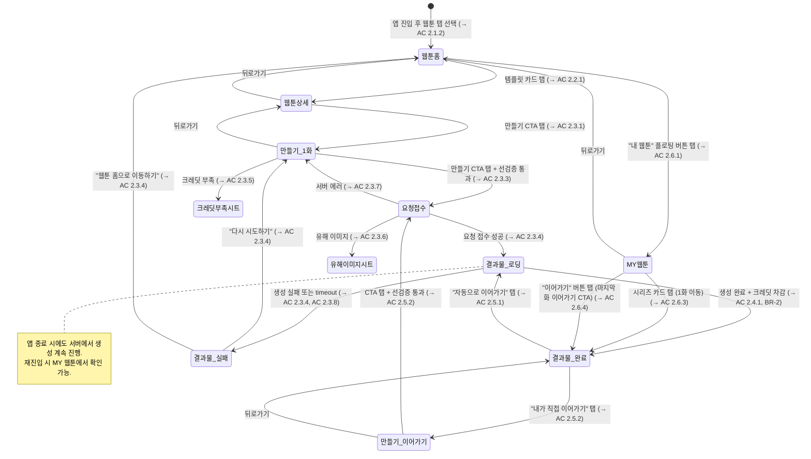
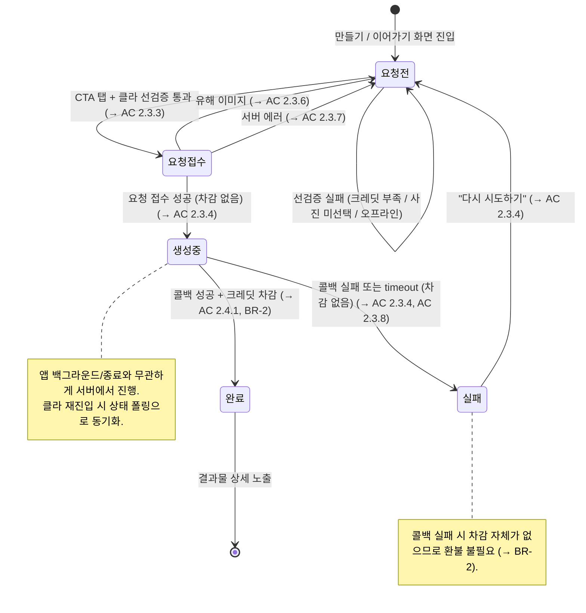
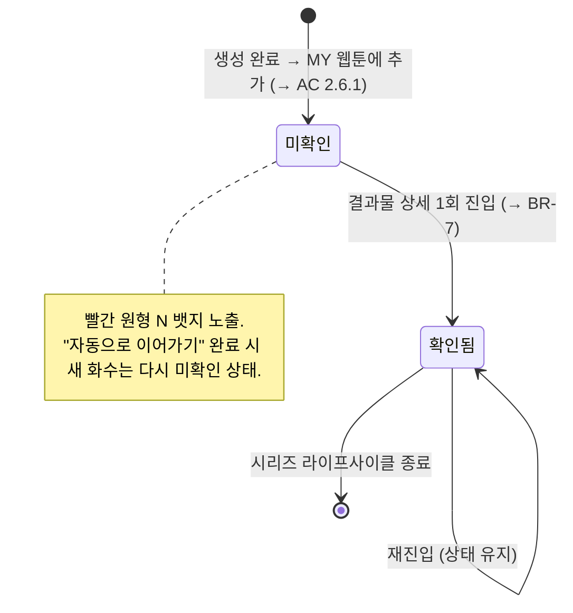

> ⚠ **DO NOT EDIT** — this file is a mirror of Notion. Re-run
> `zzem-kb:sync-active-prds` to refresh. Edit the source at https://www.notion.so/Agent-PRD-AI-v1-2-3410159c6b5981929ea5d198b3b9b244.

# [Agent PRD] AI 웹툰 서비스 v1.2

## 1. Overview

AI 웹툰 서비스: 유저가 사진 1장을 올려 나만의 AI 웹툰을 생성하고, 이어가기 구조로 크레딧 재소비와 재방문을 유도한다.

- 가설: 이어가기 구조를 제공하면 유저가 다음 화 궁금증으로 재방문해 크레딧을 재소비할 것이다.
- 성공 기준: 웹툰 생성 비중이 전체 대비 10% 이상 / 리텐션 커브 플래토 형성 / 크레딧 재구매 발생 여부

---

## 2. User Stories & Acceptance Criteria

### US-1: 유저는 웹툰 탭에서 줄거리 템플릿을 탐색하여 관심 가는 웹툰을 선택한다

- **AC 2.1.1: 홈 탭 구조**
- **AC 2.1.2: 웹툰 탭 콘텐츠 노출**
- **AC 2.1.3: 템플릿 노데이터 처리**

### US-2: 유저는 줄거리 템플릿의 1화를 미리 보고 만들기를 결정한다

- **AC 2.2.1: 템플릿 상세 페이지 진입**

### US-3: 유저는 사진을 올려 나만의 웹툰 1화를 바로 만든다

- **AC 2.3.1: 캐릭터+줄거리 입력 화면**
- **AC 2.3.2: 사진 미선택 시 CTA 비활성**
- **AC 2.3.3: 1화 생성 요청 (1단계)**
- **AC 2.3.4: AI 생성 (2단계 비동기)**
- **AC 2.3.5: 크레딧 부족 처리**
- **AC 2.3.6: 유해 이미지 감지 처리**
- **AC 2.3.7: 서버 에러 처리**
- **AC 2.3.8: 생성 Timeout 처리**

### US-4: 유저는 생성된 웹툰을 보고 다음 화를 이어서 만든다

- **AC 2.4.1: 결과물 상세 (상태 분기)**
- **AC 2.4.2: 이어가기 CTA 노출**

### US-5: 유저는 다음 화를 AI 자동 또는 직접 방향을 정해서 만든다

| 구분 | 자동 이어가기 (AC 2.5.1) | 직접 이어가기 (AC 2.5.2) |
|---|---|---|
| **유저 입력** | 없음 (CTA 탭만) | 줄거리 텍스트(필수) |
| **다음 전개 결정** | 모델이 자동 추론 | 유저 텍스트를 story beat로 반영 |
| **이전 화 참조** | 자동 주입 (→ BR-12) | 자동 주입 (→ BR-12) |

- **AC 2.5.1: 자동 이어가기**
- **AC 2.5.2: 직접 이어가기**

### US-6: 유저는 내가 만든 웹툰 시리즈를 모아보고 이어서 작업한다

- **AC 2.6.1: MY 웹툰 진입**
- **AC 2.6.2: N뱃지 제거**
- **AC 2.6.3: MY 웹툰 — 시리즈 카드 탭 (1화 이동)**
- **AC 2.6.4: MY 웹툰 — "이어가기" 버튼 탭 (이어가기 CTA 이동)**
- **AC 2.6.5: MY 웹툰 노데이터**
- **AC 2.6.6: 이어가기 시 사진 입력 정책**

---

## 3. State Machine

### 3.1 화면 네비게이션 (전체 플로우)

### 3.2 단일 생성 요청 라이프사이클 (크레딧 트랜잭션 관점)

### 3.3 결과물 확인(N뱃지) 상태

---

## 4. Business Rules

- **BR-1: 크레딧 단일 단가**
- **BR-2: 크레딧 차감 타이밍**
- **BR-3: 동시 생성 정책**
- **BR-4: 이중 탭 방지**
- **BR-5: 캐릭터 유형 결정 주체**
- **BR-6: 줄거리 입력 권한**
- **BR-7: N뱃지 노출/제거 규칙**
- **BR-8: 콘텐츠 하드코딩**
- **BR-9: 무료 생성 없음**
- **BR-10: 생성 모델 고정**
- **BR-11: 폴링 주기**
- **BR-12: 이전 화 이미지 참조**

---

## 5. 3-Tier Boundary

### ALWAYS (자동 실행)

- 1화 생성 시 사진 1장 필수 입력 검증
- 이어가기 시 이전 화 이미지를 참조로 자동 주입
- 결과물 상세 스크롤 하단에 이어가기 CTA 배치
- 기존 크레딧 시스템 그대로 활용
- 2단계 실패 시 차감 없이 에러 처리

### ASK

- 템플릿 추가/교체 — Jayla 제작 후 하드코딩
- **이전 화 이미지 참조 유의미성 검증** — Jayla 실험, 2026-04-15(수) 결과 공유 예정 (→ BR-12)
- 생성 소요 시간 & Timeout 기준 확정 — Jayla 실험으로 평균·최대 소요 시간 측정 (→ AC 2.3.8)
- 생성 모델 해상도 튜닝 — 초기 2K 하드코딩으로 개발 시작. 4K 상향 여부는 Jayla 비교 테스트 결과로 추후 결정 (블로커 아님)
- 시스템 프롬프트 튜닝 — Jayla가 만든 초기 프롬프트 1개 하드코딩으로 개발 시작. 이터레이션으로 개선 (블로커 아님)

### NEVER DO (금지)

- 자유 프롬프트로 1화를 처음부터 생성하는 기능 구현 금지 (Phase 2)
- 소셜 공유 기능 구현 금지 (Phase 2)
- 이미지 갤러리 저장 기능 구현 금지 (Phase 2)
- 웹툰 댓글/반응/좋아요 기능 구현 금지 (별도 Phase)
- 캐릭터 저장/재사용 기능 구현 금지 (Phase 2)
- 서버 어드민을 통한 템플릿 관리 구현 금지 (Phase 2)

---

## 6. Out of Scope

- 캐릭터 저장/재사용: MVP 의도적 제외 — 매번 새로 사진 업로드하는 UX
- 이미지 갤러리 저장: 화수별 저장 UX 미확정 — Phase 2 재검토
- 소셜 공유: MVP 범위 아님
- 서버 어드민 템플릿 관리: 템플릿은 앱 코드 하드코딩으로 처리
- 그림체 선택: 템플릿에 포함된 고정 그림체만 사용
- 무료 생성: 모든 생성은 크레딧 소비

---

## Appendix A. 생성 모델 호출 스펙

### 기본 원리

유저가 입력한 이미지와 이전 화 참조 이미지를 기반으로, 서버에 하드코딩된 시스템 프롬프트를 조합해 출력을 생성한다.

### 모델

- **모델명**: `fal-ai/nano-banana-2/edit`
- **해상도**: 초기값 2K 하드코딩으로 개발 시작 (1K는 자막 깨짐 이슈로 제외, Jayla 2K 기준 작업 중). 4K 상향 여부는 Jayla 비교 테스트 결과에 따라 추후 전환 (→ 5. ASK 참조, 블로커 아님)

### 1화 생성 입력 구성 (→ AC 2.3.3)

- `image_urls[]`: 유저 업로드 사진 1장 (이 값이 모델의 유일한 이미지 입력)
- `prompt`: Jayla 작성 초기 시스템 프롬프트 1개 하드코딩 + 템플릿 줄거리 + 템플릿 메타(캐릭터 유형·그림체). 초기 개발 이후 프롬프트 튜닝은 이터레이션

### 이어가기 생성 입력 구성 (→ AC 2.5.1 / AC 2.5.2)

- `image_urls[]`: 이전 화 이미지가 입력 중 하나로 포함됨 (참조 역할, BR-12). 유저 추가 사진 없음 → AC 2.6.6
- `prompt`:

### 출력

- 여러 컷이 모아진 단일 합성 이미지 1장 (웹툰 한 페이지 형태)
- i2i(Image-to-Image) 방식으로 그림체 다양화

### 제약 & 에러

- 유해 이미지 감지 → AC 2.3.6
- 콜백 실패 → BR-2 (차감 없음)
- 정상 소요 시간 초과 → AC 2.3.8 (timeout)

### 구현 고려사항

- 참조 이미지는 `image_urls[]`의 입력 중 하나로 포함되어 전달 (유의미성은 BR-12 / 5. ASK 참조)
- `FAL_AI_MODEL_INPUT_MAP`에 `nano-banana-2/edit` 엔트리 추가 필요

---

## 이전 버전

[Agent PRD] AI 웹툰 서비스 v1.1
