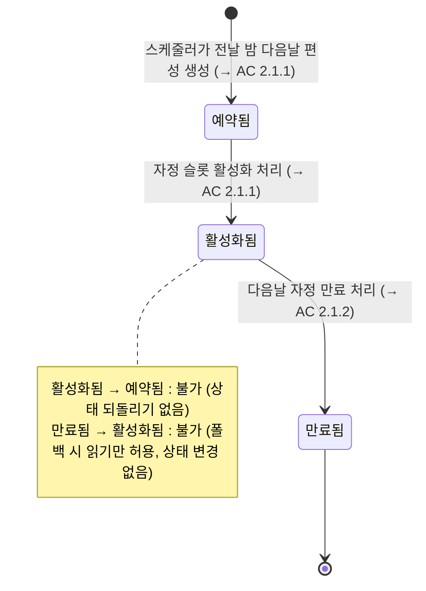
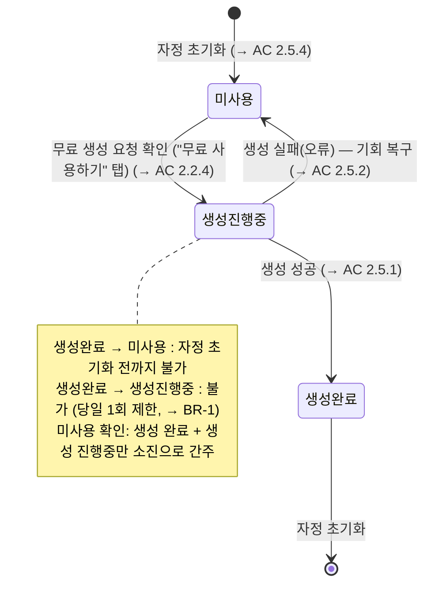
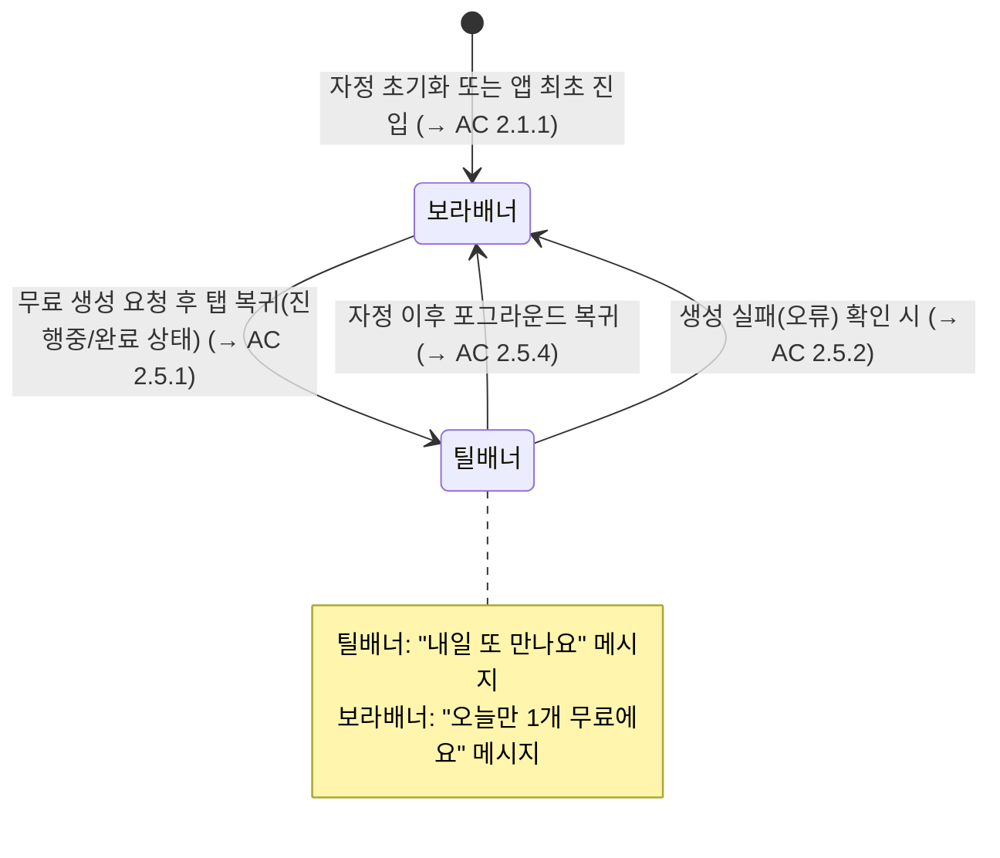

> ⚠ **DO NOT EDIT** — this file is a mirror of Notion. Re-run
> `zzem-kb:sync-active-prds` to refresh. Edit the source at https://www.notion.so/Agent-PRD-33e0159c6b598143bd62c4c136d72bd8.

# [Agent PRD] 무료탭 필터선택 다양화

## 1. Overview

- 무료탭 필터선택 다양화: 무료 필터 편성을 하루 1개에서 N개(10개)로 확장하고, 날짜별 편성 관리 구조로 전환하여 사용자의 탐색 동기와 재방문율을 높인다.

## 2. User Stories & Acceptance Criteria

### US-1: 사용자는 무료탭에서 오늘의 무료 필터 목록을 탐색하여 생성 의욕을 갖는다

- **AC 2.1.1: 무료탭 진입 시 N개 필터 그리드 표시**
- **AC 2.1.2: 필터 편성 폴백 처리**
- **AC 2.1.3: 전체 폴백 실패 시 빈 상태 안내**
- **AC 2.1.4: 무료 기회 남음 레드닷 표시**

### US-2: 사용자는 필터 카드를 탭하여 SwipeFeed에서 탐색하고 무료 생성을 완료한다

- **AC 2.2.1: 그리드 카드 탭 → SwipeFeed(무료 전용) 진입**
- **AC 2.2.2: SwipeFeed circular scroll (무한 루프)**
- **AC 2.2.3: CTA 탭 → 무료 생성 확인 바텀시트**
- **AC 2.2.4: "무료 사용하기" 탭 → 생성 플로우 진행**
- **AC 2.2.5: "더 둘러볼게요" 탭 → SwipeFeed 유지**
- **AC 2.2.6: 게스트 유저 생성 시도 → 로그인 유도**
- **AC 2.2.7: 중복 요청 방지**
- **AC 2.2.8: 사진 선택 / 크롭 취소 → SwipeFeed 복귀**
- **AC 2.2.9: 동시생성 슬롯 초과**
- **AC 2.2.10: 자정 경계 처리**
- **AC 2.2.11: 무료 생성 요청 실패 → 오류 안내 표시**

### US-3: 사용자는 SwipeFeed에서 무료 필터를 자유롭게 탐색하며 마음에 드는 필터를 선택한다

- **AC 2.3.1: SwipeFeed 내 상하 스크롤 탐색**
- **AC 2.3.2: SwipeFeed에서 그리드로 복귀**

### US-4: 사용자는 탭 이탈 후 재진입 시 이전 탐색 위치에서 이어서 탐색한다

- **AC 2.4.1: 탭 재진입 시 스크롤 위치 복원**

### US-5: 무료 생성 완료 후 재진입한 사용자에게 내일 재방문을 유도한다

- **AC 2.5.1: 생성 완료 후 틸 배너로 전환**
- **AC 2.5.2: 생성 실패 시 보라 배너 유지**
- **AC 2.5.3: 레드닷 소멸**
- **AC 2.5.4: 앱 포그라운드 복귀 시 상태 갱신**

### US-6: 무료 생성 완료 후에도 동일 필터를 유료로 생성할 수 있다

- **AC 2.6.1: 사용 완료 후 필터 그리드 유지**
- **AC 2.6.2: 사용 완료 상태 SwipeFeed — 유료 CTA 표시**
- **AC 2.6.3: 유료 CTA 탭 → 크레딧 안내 바텀시트**
- **AC 2.6.4: "크레딧 사용하기" 탭 → 유료 생성 플로우**
- **AC 2.6.5: 다른 기기에서 무료 기회 차단**

### US-7: 무료탭 외 진입점(추청탭 등)에서도 동일한 무료 생성 경험을 제공한다

- **AC 2.7.1: 추청탭 등 외부 진입점 — 동일 확인 바텀시트**
- **AC 2.7.2: 외부 진입점 "더 둘러볼게요" → 현재 피드 유지**
- **AC 2.7.3: 외부 진입점 — 사용 완료 상태 유료 CTA**

## 3. State Machine

### 3.1 날짜별 무료 필터 슬롯 상태

### 3.2 사용자 일별 무료 생성 기회 상태

### 3.3 무료탭 배너 상태

## 4. Business Rules

- **BR-1: 1일 1회 무료 생성 제한**
- **BR-2: 생성 실패는 무료 기회 미소진**
- **BR-3: DB 레벨 중복 생성 방지**
- **BR-4: 이미지 단일 입력 필터만 무료 편성 가능**
- **BR-5: 테마별 편성 비율**
- **BR-6: 그리드 순서 = SwipeFeed 순서 고정 동기화**
- **BR-7: 스케줄러 폴백 순서**
- **BR-8: 스케줄러 실행 순서**
- **BR-9: 스케줄러 멱등성 보장**
- **BR-10: 서버 선배포 원칙**
- **BR-11: 구앱 하위 호환 — 기존 1개 필터 경험 유지**
- **BR-12: 서버가 생성 시점에 슬롯 자동 매핑**
- **BR-13: 필터 목록 API에 오늘 무료 사용 여부 포함**
- BR-14: 추청탭 필터 풀 — 무료 필터 포함 유지
- **BR-15: 무료 생성 시 크레딧 선차감 없음**
- **BR-16: 날짜 경계 기준 시간대 — KST(UTC+9)**

## 5. 3-Tier Boundary

### ALWAYS (자동 실행)

- 서버가 생성 시점에 필터 정보와 오늘 날짜로 해당 무료 슬롯을 자동 조회·연결 (앱이 슬롯 식별자 전달 불필요)
- 1일 1회 무료 체크는 DB 레벨 고유 제약으로 보장 (레이스 컨디션으로 인한 중복 무료 생성 원천 차단)
- 스케줄러 단계별 에러 격리 — 슬롯 활성화 / 만료 처리 / 다음날 예약 생성을 각각 독립 실행하여 한 단계 실패가 전체를 중단시키지 않음
- 스케줄러 실패 시 즉시 Slack/Datadog 알림 발송 (수동 개입 감지용)
- SwipeFeed 진입 시 그리드에서 이미 받은 필터 목록 재사용 (추가 API 호출 없음)
- 탭 스크롤 위치 복원 구현 시 무료탭과 추청탭 모두 동일 방식으로 함께 적용 (공통 인프라 변경)
- 구앱 하위 호환 유지 — 응답 구조 변경 없이 신규 필드만 추가
- 서버 배포 완료 확인 후 앱 배포 진행

### ASK (PM 확인 필요)

- 무료 생성 시 차감 크레딧 수치의 외부 분석 시스템 로깅 포함 여부 — 팀 내 재화 관련 외부 로깅 정책 확인 필요 (Bob)
- 어드민에서 특정 날짜에 특정 필터를 수동 편성할 수 있는 기능 필요 여부 — 운영팀 워크플로우 확인 필요 (Jayla)
- 기존 필터 176개에 테마 태그(아기/반려동물/인물) 일괄 부속 방법 — MongoDB 직접 업데이트 vs 어드민 API vs 팩토리 일괄 기능 중 팀 선호 방식 확인 (Bob/Jayla) ⚠️ 블로커: 서버 배포 전 완료 필수
- Retool에서 관리하던 무료 필터 칩 진열 기능의 실제 사용 여부 확인 — 사용 중이면 대체 방안 마련 후 제거, 미사용이면 레거시로 즉시 제거 (Jayla)
- 티켓(무료 생성권) 아이콘 에셋 — 앱·CDN 모두 미존재. Figma에서 export 후 CDN 업로드 필요. Owen 담당 여부 확인

### NEVER DO (금지)

- 필터별 무료 사용 여부 체크 사용 금지 → 반드시 유저 전체 기준 글로벌 체크 사용 (필터별 체크 시 N개 필터를 N번 무료 생성하는 허점 발생)
- 앱이 슬롯 식별자를 생성 요청에 포함하는 방식 금지 — 서버가 자동 매핑하는 구조 유지
- 무료 생성 완료 후 필터를 그리드/SwipeFeed에서 제거·숨김 처리 금지 → 유료 가격으로 계속 노출해야 함
- 생성 실패(오류) 상태를 무료 기회 소진으로 처리 금지 (재시도 허용)
- 조합 필터·영상 필터를 무료 편성 대상에 포함 금지
- SwipeFeed 진입 시 필터 목록 추가 API 호출 금지 (그리드 응답 데이터 재사용)
- 배너·푸시 문구에 "여러 개", "골라보세요" 등 복수형 표현 사용 금지 (기대 불일치 발생)

## 6. Out of Scope

- Task 2 (이후 몇일간 필터 예고 + 알림 등록): 본 태스크 이후 단계. 예고 필터 노출로 인해 그리드 콘텐츠가 증가하면 카테고리 칩 추가를 재검토
- Task 3 (아기/강아지/내 사진 테마 이미지 페르소나): 본 태스크 이후 단계

## 후속 작업

- 기능 구현: 이 PRD 기반으로 코드 개발
- 이벤트 로그: 구현 완료 후 별도 레이어에서 작업
- A/B 실험: 구현 완료 후 /ab-test 스킬로 실험 세팅
