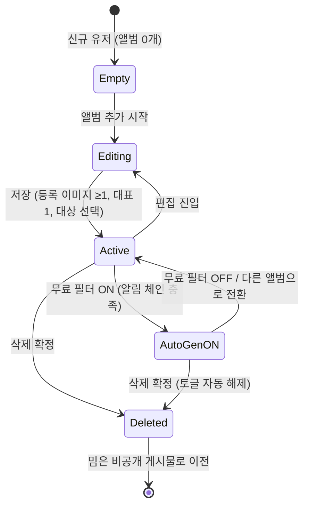
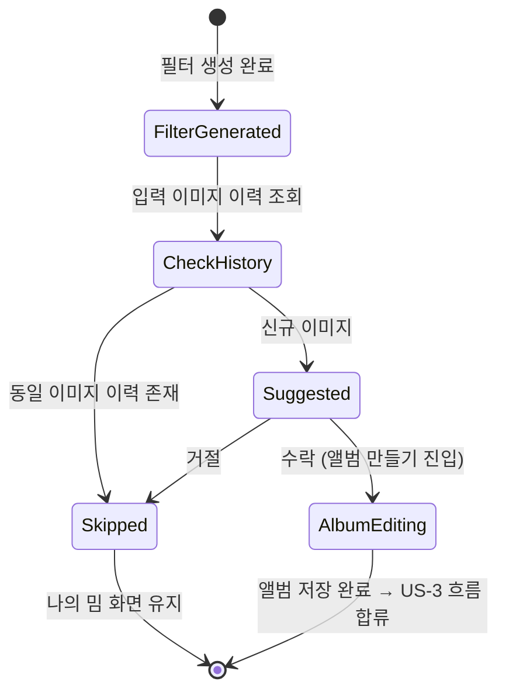
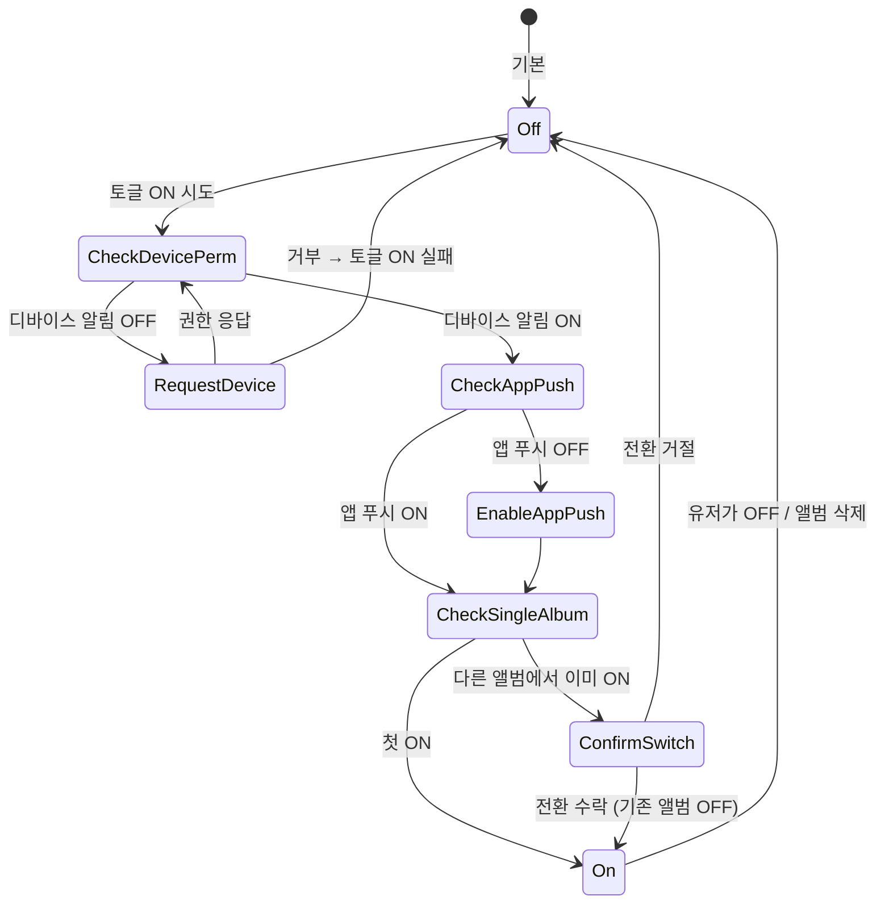

# 인물 단위 앨범 — 매일 자동 생성 + 푸시 리텐션

## Overview

유저가 특정 인물 사진을 등록해 만든 "앨범"에, 매일 오후 8시(KST) 새로운 무료 AI
필터가 자동 생성되어 도착한다. 앨범에 쌓이는 밈은 공개 피드(마이 탭)와 완전히
분리되어 보관되며, 푸시 알림으로 유저를 매일 다시 부른다.

핵심은 세 가지다.
1. **관계 기반 컨테이너** — 앨범은 인물(예: 아이유) 단위. 한 유저는 최대 10개
   앨범을 가질 수 있고, 그중 1개만 "무료 필터 받기"를 켤 수 있다.
2. **자동 생성 + 푸시 리텐션** — 매일 KST 20시, 무료 필터 ON 앨범의 대표
   이미지를 입력으로 새 필터 1개를 자동 생성하고 푸시로 알린다.
3. **공개 피드와 분리** — 앨범에 들어간 밈은 마이 탭(유저 프로필 공개 피드)에
   노출되지 않는다. 앨범 삭제 시 밈은 프로필의 비공개 게시물로 이전된다.

## Why

기존 필터/커스텀 생성은 유저가 매번 사진을 올리고 액션해야 하는 **풀(pull)** 모델.
앨범은 한 번만 세팅하면 매일 자동으로 콘텐츠가 생성되는 **푸시(push)** 모델로,
"내 캐릭터로 매일 새 밈"이라는 콘텐츠 팩토리 경험을 만든다.

KPI는 D+N 리텐션과 푸시 CTR. 자동 생성된 필터는 결국 다시 유저에게 코인 소비
액션("다시 생성하기")으로 연결될 수 있어, 활성 사용자 풀을 키운다.

---

## User Stories & Acceptance Criteria

### US-1. 앨범 탭에서 인물별 밈 보기
유저로서, 앨범 탭에 진입해 인물 프로필을 선택하면 해당 인물로 만든 밈만
모아서 볼 수 있다. 이 밈들은 마이 탭(공개 피드)에는 노출되지 않는다.

**AC-1.1 — 앨범 0개일 때 빈 상태**
- Given 앨범 탭에 처음 진입했고 보유한 앨범이 0개일 때
- When 화면이 렌더링되면
- Then 상단 캐러셀에는 "앨범 추가" 버튼만 단독 노출되고
- And 그리드 중앙에 "아직 게시물이 없어요" 안내 텍스트가 표시된다

**AC-1.2 — 인물 프로필 선택**
- Given 앨범 탭에 진입했고 1개 이상의 앨범을 보유했을 때
- When 상단 캐러셀의 인물 프로필을 탭하면
- Then 해당 앨범에 속한 밈만 그리드에 표시되고
- And 마이 탭의 공개 피드 게시물에는 이 밈들이 노출되지 않는다

---

### US-2. 새 이미지로 필터 생성 시 앨범 제안 받기
유저로서, 새로 업로드한 이미지로 처음 필터를 만들면, 그 사진을 앨범으로
저장할지 제안을 받는다. 같은 사진을 다시 사용할 때는 제안받지 않는다.

**AC-2.1 — 새 이미지 판별 시 자동 제안**
- Given 유저가 이미지를 업로드해 필터 생성을 완료했을 때
- When 해당 이미지가 이 유저의 입력 이미지 이력에 없는 신규 이미지로 판별되면
- Then 생성 결과 화면 위에 앨범 제안 바텀시트가 자동으로 뜬다
- And 본문은 "이 사진을 앨범에 저장할까요? / 이 사진으로 특별한 이미지를
  매일 만들어서 보내드릴게요" 카피로 표시된다

**AC-2.2 — 제안 거절 시**
- Given 앨범 제안 바텀시트가 열렸을 때
- When 유저가 거절 액션을 선택하면
- Then 바텀시트가 닫히고 나의 밈 화면 상태로 돌아간다
- And 같은 이미지로는 다시 제안하지 않는다

**AC-2.3 — 동일 이미지 재업로드는 제안 안 함**
- Given 입력 이미지 이력에 동일 이미지(바이트 동일 또는 해시 동일)가 이미 존재할 때
- When 유저가 그 이미지로 필터를 다시 생성해도
- Then 앨범 제안 바텀시트는 뜨지 않는다

---

### US-3. 앨범 추가 (수동 생성)
유저로서, 앨범 탭에서 직접 인물 사진을 골라 앨범을 만들 수 있다.

**AC-3.1 — 앨범 추가 진입**
- Given 보유 앨범이 10개 미만일 때
- When 앨범 탭에서 "앨범 추가"를 탭하면
- Then 사진 선택 → 크롭 → 앨범 편집(이름/대상/토글) → 저장 흐름이 시작된다

**AC-3.2 — 앨범 개수 상한**
- Given 보유 앨범이 이미 10개일 때
- When 유저가 "앨범 추가"를 시도하면
- Then 앨범 개수 상한 안내가 표시되고 신규 생성이 차단된다

**AC-3.3 — 등록 이미지 8장 상한 + 대표 이미지 1장**
- Given 앨범 편집 화면에서 등록 이미지 영역을 다룰 때
- Then 최대 8장까지만 등록 가능하고
- And 그중 정확히 1장이 체크 표시로 "대표 이미지"로 선정되어야 한다
- When 유저가 다른 이미지에 체크를 표시하면
- Then 기존 대표 이미지의 체크는 해제되고 새 이미지가 대표가 된다

**AC-3.4 — 사진 속 대상 선택**
- Given 앨범 편집 화면을 다룰 때
- Then "사진 속 대상" 드롭다운은 [아이, 어른, 동물] 3개로 고정된다
- And 신규 앨범 생성 시 대상 선택은 필수다

---

### US-4. 앨범 편집 / 삭제
유저로서, 만든 앨범의 이름·대표 이미지·토글 설정을 수정하거나, 앨범을 삭제할 수 있다.

**AC-4.1 — 무료 필터 받기 토글: 유저당 1앨범만**
- Given 유저가 이미 다른 앨범에서 "무료 필터 받기"를 ON 상태로 두었을 때
- When 다른 앨범의 무료 필터 받기 토글을 ON 시도하면
- Then "이미 다른 앨범에서 켜져 있어요" 바텀시트가 뜨고
- And 유저가 전환 선택 시 기존 앨범의 토글은 OFF, 신규 앨범이 ON으로 바뀐다

**AC-4.2 — 무료 필터 받기 ON 시 알림 체인 자동 설정**
- Given 무료 필터 받기 토글을 ON 시도할 때
- When 디바이스 알림 권한 또는 앱 푸시 알림 설정이 꺼져 있다면
- Then 활성화를 유도하는 모달이 단계적으로 뜬다
- And 디바이스 → 앱 푸시 → 앨범 무료 필터 알림 셋 모두 ON 상태가 아니면 토글 ON이 확정되지 않는다

**AC-4.3 — 수정사항 있을 때 나가기 차단**
- Given 앨범 편집 화면에서 수정사항이 존재할 때
- When 유저가 저장 없이 뒤로가기/닫기를 시도하면
- Then "수정사항이 있습니다. 그래도 나가시겠습니까?" 확인 모달이 뜬다

**AC-4.4 — 앨범 삭제: 밈은 비공개 게시물로 이전**
- Given 유저가 앨범을 삭제할 때
- When 삭제 확인 바텀시트에서 "삭제하기"를 누르면
- Then 앨범 자체는 영구 삭제되고 복구 불가다
- And 앨범에 속해 있던 밈들은 유저 프로필의 비공개 게시물로 이전된다
- And 해당 앨범의 무료 필터 받기 설정도 함께 해제된다

---

### US-5. 매일 오후 8시(KST) 푸시 알림
무료 필터 받기 ON 앨범을 가진 유저로서, 매일 KST 20시에 새로 자동 생성된
무료 필터의 도착을 푸시로 받는다.

**AC-5.1 — 자동 생성 + 푸시**
- Given 유저가 무료 필터 받기 ON 앨범을 1개 보유했을 때
- When KST 20시 배치가 실행되면
- Then 해당 앨범의 대표 이미지를 입력으로 새 필터 1개가 자동 생성되고
- And 알림 체인이 모두 ON인 유저에게 푸시가 발송된다
- And 푸시 본문은 "[인물명]의 '[필터명]' 이미지가 도착했어요!" 형식이다

**AC-5.2 — 알림 보존 1개월**
- Given 인앱 알림 센터를 다룰 때
- Then 최근 1개월 이내의 알림만 노출된다
- And 푸터에 "1개월 전 알림까지 확인할 수 있어요"가 표시된다

**AC-5.3 — 알림에서 진입한 밈 상세의 뒤로가기**
- Given 푸시 또는 알림 센터에서 자동 생성 밈 상세로 진입했을 때
- When 유저가 뒤로가기/닫기를 누르면
- Then 앨범 탭의 해당 인물 프로필이 활성화된 상태로 이동한다

---

## State Machine

### Album lifecycle

### Album suggestion modal (US-2)

### Free-filter toggle (US-4 AC-4.2)

---

## Business Rules

### 한도 / 제약
- 유저당 앨범 최대 **10개**
- 앨범당 등록 이미지 최대 **8장**, 그중 정확히 **1장**이 대표 이미지
- 유저당 "무료 필터 받기" ON 앨범은 **동시에 1개**만 허용
- "사진 속 대상" 카테고리는 **[아이, 어른, 동물] 3개로 고정**
- 인앱 알림 보존 기간: **최근 1개월**

### 자동 생성 배치
- 실행 시각: **매일 KST 20:00** 단일 배치
- 입력: 무료 필터 ON 앨범의 **대표 이미지 1장**
- 출력: 새 필터 1개를 해당 앨범 소속으로 자동 생성
- 푸시 발송: 자동 생성 완료 + 알림 체인 충족 유저에게만 발송
- 푸시 본문 포맷: `[인물명]의 '[필터명]' 이미지가 도착했어요!`

### 알림 체인 (3단)
- 디바이스 알림 권한(OS) → 앱 푸시 알림 설정 → 앨범별 무료 필터 받기
- 토글 ON 흐름에서 위 3단이 모두 ON일 때만 토글 ON이 확정된다
- 어느 한 단이라도 OFF이면 활성화 유도 모달을 단계적으로 표시한다

### 분리 정책
- 앨범에 속한 밈은 마이 탭(유저 프로필 공개 피드)에 노출되지 않는다
- 앨범 삭제 시 밈은 영구 삭제되지 않고 **유저 프로필의 비공개 게시물로 이전**된다
- 앨범 본체는 삭제 시 영구 삭제(복구 불가)

### 신규 이미지 판별
- 유저별 입력 이미지 이력을 보존하여 동일 이미지(바이트/해시 동일) 여부 판별
- v1에서는 동일 이미지만 판별, **동일 인물 매칭은 하지 않는다**
- 동일 이미지로 필터를 다시 생성해도 앨범 제안 모달은 뜨지 않는다

### 카피 (확정)
- 앨범 제안 모달 제목: "이 사진을 앨범에 저장할까요?"
- 앨범 제안 모달 본문: "이 사진으로 특별한 이미지를 매일 만들어서 보내드릴게요"
- 편집 나가기 모달: "수정사항이 있습니다. 그래도 나가시겠습니까?"
- 삭제 모달 제목: "[인물명] 앨범을 삭제하시겠어요?"
- 삭제 모달 안내 1: "이 앨범은 영구적으로 삭제되며, 한 번 삭제하면 다시 복구할 수 없어요."
- 삭제 모달 안내 2: "앨범 속 밈은 회원님의 프로필 비공개 게시물로 옮겨져요."
- 빈 상태 텍스트: "아직 게시물이 없어요"
- 알림 보존 푸터: "1개월 전 알림까지 확인할 수 있어요"

---

## 3-Tier Boundary

### Tier 1: MUST DO (반드시 한다)
- meme-api에 앨범 도메인을 신규 추가한다 (스키마, 서비스, 컨트롤러, 배치)
- Content 스키마에 앨범 소속과 공개/비공개 구분을 표현할 수 있는 식별자를
  추가한다 (필드명은 에이전트 재량)
- NotificationSetting에 앨범별 무료 필터 받기 설정을 표현한다 (위치/구조는 에이전트 재량)
- 유저별 입력 이미지 이력 저장 구조를 신설한다 (앨범 제안 모달의 신규 판별 근거)
- 매일 KST 20시 단일 배치로 자동 생성 + 푸시 발송을 실행한다
  (기존 `batch/`, `gen-meme.scheduler.ts`, `send-meme-gen-push` 패턴 재사용)
- MemeApp에 앨범 도메인 화면(앨범 탭, 추가/편집/삭제)을 신규 추가한다
  (기존 `gorhom-sheet/bottom-confirm-sheet`, `meme-push-switch` 재사용)
- 무료 필터 ON 흐름에서 알림 체인 3단을 모두 검증하고, 미충족 단계마다
  활성화 유도 모달을 띄운다
- 앨범 삭제 시 소속 밈을 유저 비공개 게시물로 이전한다

### Tier 2: SHOULD DO (가능하면 한다)
- 빈 상태/에러 상태에서 명확한 안내 카피를 제공한다
- 푸시 발송 실패에 대한 재시도 또는 폴백 로깅을 한다
- "다시 보지 않기" 등 기존 모달 옵션 패턴과 일관성을 유지한다
- 등록 이미지 8장 상한 도달 시 추가 시도를 미리 차단하는 UX 가드를 둔다

### Tier 3: NEVER DO (절대 하지 않는다)
- 동일 이미지 외의 인물 매칭(얼굴 인식, 같은 사람 자동 그룹핑)을 v1에서 구현하지 않는다
- 앨범에 속한 밈을 마이 탭 공개 피드에 노출하지 않는다
- 무료 필터 받기 ON 앨범을 2개 이상 허용하지 않는다
- 카테고리 "[아이, 어른, 동물]"을 자유 입력으로 받지 않는다 (3개 고정)
- 기존 필터 탭 / 커스텀 탭의 생성 흐름을 앨범과 연동하지 않는다 (이번 스코프 아님)
- 매일 자동 생성 배치를 KST 20:00 이외의 시간대로 분기 발송하지 않는다
- 앨범 본체 삭제를 소프트 딜리트로 처리하지 않는다 (영구 삭제 + 밈만 비공개 이전)

---

## Out of Scope

- 기존 필터 탭 / 커스텀 탭의 생성 흐름과 앨범의 연결 (다음 스코프)
- 얼굴 인식 / 동일 인물 자동 매칭 (v1은 동일 이미지 판별만)
- 같은 인물 사진 재업로드 시 기존 앨범으로의 자동 합치기
- 앨범의 공개/비공개 토글 (v1은 "마이 탭 공개 피드와 분리"가 디폴트)
- 앨범 공유 / 협업 (다른 유저 초대)
- 앨범 단위 통계 / 인사이트 화면
- 푸시 발송 시간대 개인화 (유저별 활동 시간 기반)
- 해외 유저 타임존 대응 (v1은 KST 고정)
- 앨범 정렬 / 검색 / 필터링 UI
- 자동 생성 결과의 코인 보상 / 가격 정책 변경 (기존 "다시 생성하기" 코인 시스템 유지)
- 인앱 알림 1개월 이전 보존 / 페이지네이션

---

## 참고

- Figma: https://www.figma.com/design/7hozJ6Pvs09q98BxvChj08/Wrtn-X_%EC%A8%88_Sprint-File?node-id=38834-10597
- 코드 위치
  - 백엔드: `wrtn-backend/apps/meme-api`
  - 앱: `app-core-packages/apps/MemeApp`
- 재사용 가능한 기존 패턴
  - `meme-api/src/batch/`, `gen-meme.scheduler.ts`, `send-meme-gen-push.spec.ts`
  - `MemeApp/src/shared/ui/gorhom-sheet/bottom-confirm-sheet.tsx`
  - `MemeApp/src/presentation/settings/components/meme-push-switch.tsx`
  - `MemeApp/src/app/navigation/useRequestPushPermission.ts`
