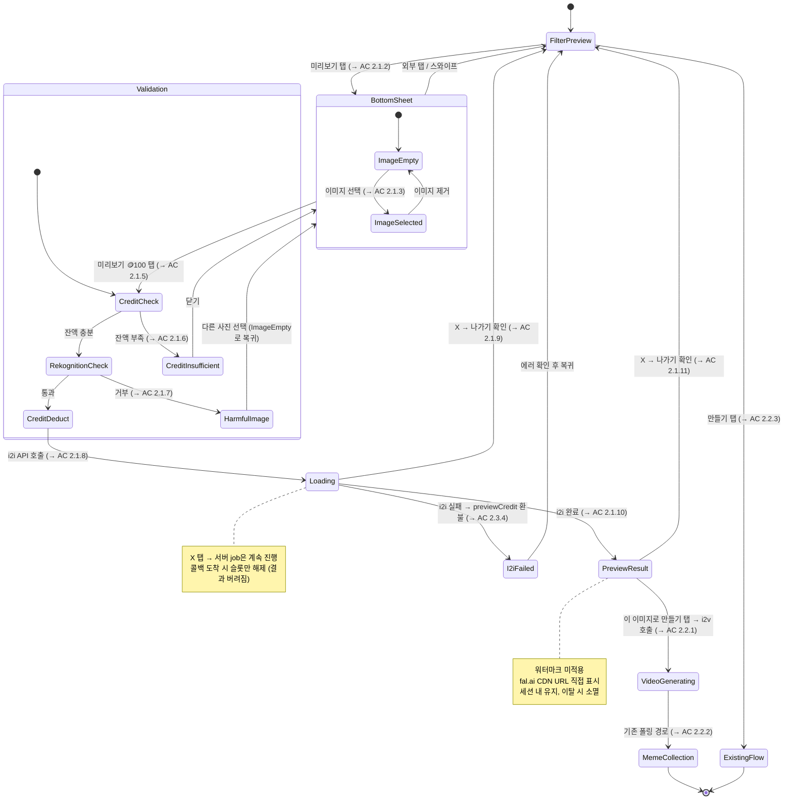

## 1. Overview

결과물 미리보기: workflow 필터(i2i+i2v)의 i2i 결과 이미지를 먼저 보여주어,
유저가 결과물을 확인한 뒤 비디오 생성(i2v)을 결정할 수 있게 한다.
프리뷰 진입 대비 비디오 생성 전환율 2배 향상 목표 (~10% → ~20%).

---

## 2. User Stories & Acceptance Criteria

### US-1: 유저는 workflow 필터의 결과물을 미리 확인하여 비디오 생성 여부를 결정한다

- **AC 2.1.1: 미리보기 버튼 노출**
  - Given: FilterPreview 화면에서 `hasDecompPreview: true`인 workflow 필터를 보고 있는 상태
  - When: 하단 버튼 영역이 렌더링될 때
  - Then: [미리보기] + [만들기 🪙{총액}] 두 버튼이 수평 배치된다
  - Note: `hasDecompPreview: false`이면 기존 단일 버튼([만들기]) 유지

- **AC 2.1.2: 바텀시트 진입**
  - Given: FilterPreview 화면에서 미리보기 버튼이 노출된 상태
  - When: [미리보기] 버튼을 탭하면
  - Then: "결과물 미리보기" 바텀시트가 열리고, 소구 텍스트 + [+] 이미지 첨부 UI + [미리보기 🪙100] 버튼(비활성)이 표시된다

- **AC 2.1.3: 이미지 선택**
  - Given: 바텀시트가 열린 상태
  - When: [+] 버튼을 탭하면
  - Then: 기존 사진 앨범 선택 화면이 열리고(1장 제한), 선택 후 바텀시트에 썸네일이 표시된다 (X로 제거 가능). ImageGuidance 시트는 표시하지 않는다

- **AC 2.1.4: 미리보기 버튼 활성화**
  - Given: 바텀시트가 열린 상태
  - When: 이미지가 선택되지 않은 상태이면
  - Then: [미리보기 🪙100] 버튼이 비활성
  - When: 이미지가 선택된 상태이면
  - Then: [미리보기 🪙100] 버튼이 활성화

- **AC 2.1.5: 미리보기 실행 — 검증 순서**
  - Given: 이미지가 선택된 상태에서
  - When: [미리보기 🪙100] 버튼을 탭하면
  - Then: ①크레딧 잔액 확인 → ②Rekognition 윤리 체크 → ③크레딧 차감(previewCredit) → ④i2i API 호출 순서로 처리된다. 크레딧 차감 전에 모든 검증이 완료되므로 크레딧 손실 없음

- **AC 2.1.6: 크레딧 부족**
  - Given: 크레딧 잔액이 previewCredit(100) 미만인 상태에서
  - When: [미리보기 🪙100] 버튼을 탭하면
  - Then: 기존 크레딧 부족 바텀시트가 표시된다 ("크레딧이 다 떨어졌어요")

- **AC 2.1.7: 유해 이미지 감지**
  - Given: 크레딧 잔액이 충분한 상태에서
  - When: Rekognition이 유해 이미지로 판정하면
  - Then: 유해 이미지 바텀시트가 표시되고 ("적절하지 않은 이미지를 감지했어요"), "다른 사진 선택하기" 탭 시 바텀시트 이미지 첨부 상태로 복귀한다

- **AC 2.1.8: 로딩 화면**
  - Given: i2i API 호출이 시작된 상태
  - When: 바텀시트가 닫히면
  - Then: 전체 화면 로딩 뷰로 전환된다 (X 버튼 + 스피너 + "미리보기 만드는중...")

- **AC 2.1.9: 로딩 중 이탈**
  - Given: 로딩 화면이 표시된 상태에서
  - When: X 버튼을 탭하면
  - Then: 확인 다이얼로그가 표시된다 ("지금 나가면 작업이 취소되고, 사용한 크레딧은 환불되지 않아요. 정말 나가시겠어요?" [취소] [나가기]). 서버의 fal.ai job은 계속 진행되며 콜백 도착 시 슬롯만 해제된다

- **AC 2.1.10: 프리뷰 결과 표시**
  - Given: i2i 생성이 완료된 상태
  - When: 결과 이미지가 수신되면
  - Then: 전체 화면에 프리뷰 이미지가 9:16 비율로 표시되고, 하단에 [이 이미지로 만들기 🪙{총액 - previewCredit}] 버튼이 표시된다. 프리뷰 이미지에는 워터마크를 적용하지 않는다

- **AC 2.1.11: 결과 화면 이탈**
  - Given: 프리뷰 결과 화면이 표시된 상태에서
  - When: X 버튼을 탭하면
  - Then: 확인 다이얼로그가 표시된다 ("지금 나가면 이 결과를 다시 볼 수 없어요" [취소] [나가기])

---

### US-2: 유저는 프리뷰 결과가 마음에 들면 해당 이미지로 비디오를 생성한다

- **AC 2.2.1: 비디오 생성 전환**
  - Given: 프리뷰 결과 화면에서 이미지를 확인한 상태
  - When: [이 이미지로 만들기 🪙{잔액}] 버튼을 탭하면
  - Then: i2v 크레딧(총액 - previewCredit)이 차감되고, i2v API가 호출되고, MemeCollection으로 이동한다 (기존 fire-and-forget 패턴)

- **AC 2.2.2: i2v 생성 진행 표시**
  - Given: i2v API 호출 후 MemeCollection으로 이동한 상태
  - When: 기존 active generations 폴링이 동작하면
  - Then: i2v Content가 "생성중..." 상태로 표시되고, 완료 시 결과 썸네일로 전환된다 (기존 폴링 경로 그대로 사용)

- **AC 2.2.3: 기존 만들기 경로 유지**
  - Given: `hasDecompPreview: true`인 필터의 FilterPreview 화면에서
  - When: [만들기 🪙{총액}] 버튼을 탭하면
  - Then: 기존 atomic workflow(i2i+i2v 일괄) 경로가 그대로 실행된다

---

### US-3: 시스템은 프리뷰 콘텐츠를 기존 플로우와 격리한다

- **AC 2.3.1: 프리뷰 Content 비노출**
  - Given: i2i 프리뷰로 생성된 Content가 존재하는 상태
  - When: MemeCollection 콘텐츠 목록 API가 호출되면
  - Then: `isHidden: true`인 i2i Content는 목록에서 제외된다 (서버에서 필터링)

- **AC 2.3.2: parentFilterId 기반 네비게이션**
  - Given: i2v로 생성된 Content가 MemeCollection에 표시된 상태
  - When: 해당 Content에서 필터 상세, 딥링크, 워터마크 CreditPaywall 등으로 진입할 때
  - Then: child filter ID가 아닌 parentFilterId를 사용하여 parent 필터로 네비게이션한다

- **AC 2.3.3: 콜백 분기 처리**
  - Given: fal.ai에서 i2i 생성 완료 콜백이 도착한 상태
  - When: 해당 Content의 decompRole이 'i2i'이면
  - Then: S3 저장, 썸네일 생성, 워터마크 적용 후처리를 건너뛰고, fal.ai CDN URL을 결과로 보존한다

- **AC 2.3.4: i2i 실패 시 전액 환불**
  - Given: i2i API 호출 후 생성이 실패한 상태
  - When: 에러 콜백이 도착하면
  - Then: previewCredit이 전액 환불된다 (기존 refund 패턴)

- **AC 2.3.5: i2v 실패 시 부분 환불**
  - Given: i2v API 호출 후 생성이 실패한 상태
  - When: 에러 콜백이 도착하면
  - Then: i2v 크레딧(총액 - previewCredit)만 환불된다. i2i 크레딧(previewCredit)은 유지 (프리뷰 서비스 이행됨)

- **AC 2.3.6: 동시 생성 슬롯 관리**
  - Given: 기존 동시 생성 슬롯 풀(MAX_CONCURRENT_GENERATIONS)이 운영되는 상태
  - When: 프리뷰 i2i 또는 i2v가 실행되면
  - Then: 동일한 슬롯 풀에서 슬롯을 점유한다. i2i 완료 후 슬롯을 반환하고, i2v 시 다시 점유한다

---

## 3. State Machine

---

## 4. Business Rules

- **BR-1: 과금 구조**
  - 총액 = parent filter의 requiredCredit (고정, 예: 3960)
  - i2i 프리뷰 차감: previewCredit = 100 [configurable]
  - i2v 비디오 차감: 총액 - previewCredit (예: 3860)
  - 총액은 항상 parent.requiredCredit과 동일 (유저에게 추가 비용 없음)
  - child filter의 requiredCredit은 사용하지 않음
  - → AC 2.1.5, AC 2.2.1 참조

- **BR-2: 검증 순서**
  - 크레딧 잔액 확인 → Rekognition 윤리 체크 → 크레딧 차감 → API 호출
  - 크레딧 차감은 모든 검증 통과 후에만 실행 → 크레딧 손실 없음
  - BR-2는 BR-1보다 우선 (차감 전에 반드시 검증)
  - → AC 2.1.5 참조

- **BR-3: 환불 정책**
  - i2i 실패 → previewCredit 전액 환불
  - i2v 실패 → i2v 크레딧(총액 - previewCredit)만 환불. previewCredit은 유지 (프리뷰 서비스 이행됨)
  - → AC 2.3.4, AC 2.3.5 참조

- **BR-4: 동시 생성 슬롯**
  - 프리뷰 i2i, i2v 모두 기존 슬롯 풀(MAX_CONCURRENT_GENERATIONS)에 포함
  - i2i 완료 후 슬롯 반환 → 유저 결정 → i2v 시 슬롯 재점유
  - 슬롯 부족 시 기존 429 에러 패턴 재사용
  - → AC 2.3.6 참조

- **BR-5: 타임아웃**
  - i2i 프리뷰: 3분 [configurable] (p99 기준, 기존 workflow 20분 대비 대폭 단축)
  - 클라이언트 타임아웃 없음 — 유저가 X 버튼으로 직접 이탈
  - → AC 2.1.9 참조

- **BR-6: 워터마크 정책**
  - i2i 프리뷰 이미지에 워터마크를 적용하지 않음
  - 프리뷰의 목적(결과물 품질 확인)에 충실하기 위한 결정
  - → AC 2.1.10 참조

- **BR-7: 프리뷰 이미지 수명**
  - fal.ai CDN URL을 직접 사용 (S3 복사 없음)
  - 결과 화면이 열려있는 동안만 유효 — 이탈 시 소멸
  - CDN URL 만료 시 i2v 실패 가능 → 기존 에러 핸들링으로 처리 (극소수 케이스)
  - → AC 2.1.10, AC 2.1.11 참조

- **BR-8: hasDecompPreview 자동 세팅**
  - agent endpoint에서 decompRole: 'i2i' child filter 등록 시 → parent filter에 hasDecompPreview: true 자동 세팅
  - Content Factory 변경 없음 — 기존 child filter 등록 구조 그대로 유지
  - → AC 2.1.1 참조

- **BR-9: 콘텐츠 노출 규칙**
  - i2i Content: isHidden: true, MemeCollection 비노출
  - i2v Content: isHidden: false, MemeCollection 정상 노출
  - 서버 콘텐츠 목록 API에서 isHidden: true 필터링 → 앱 변경 없음
  - → AC 2.3.1 참조

- **BR-10: parentFilterId 사용 규칙**
  - 필터 상세 조회, 딥링크, 워터마크 CreditPaywall 네비게이션 → parentFilterId 사용
  - 이벤트 로깅, BQ 분석, 생성 비용 추적 → child filterId 사용
  - → AC 2.3.2 참조

- **BR-11: 콜백 분기**
  - 기존 fal.ai 콜백 경로 재사용
  - Content의 decompRole === 'i2i' → S3 저장, 썸네일 생성, 워터마크 적용 후처리 스킵
  - decompRole이 'i2i'가 아닌 경우 → 기존 후처리 로직 그대로 실행
  - → AC 2.3.3 참조

- **BR-12: 적용 대상 제한**
  - workflow 필터(i2i+i2v 조합)에만 적용 — motion-control, character-swap 등
  - 1장 입력 필터 전용 — 2장 입력 필터에는 미적용 (운영으로 배제)
  - → AC 2.1.1 참조

---

## 5. 3-Tier Boundary

### ALWAYS (자동 실행)
- preview 전용 엔드포인트 3개를 parent filter ID 기반으로 신규 생성한다 (기존 gen 엔드포인트와 분리)
- 기존 fal.ai 콜백 경로를 재사용하고, decompRole로 i2i 프리뷰 콘텐츠를 분기한다
- i2i Content 생성 시 isHidden: true, parentFilterId, decompRole: 'i2i'를 세팅한다
- i2v Content 생성 시 isHidden: false, parentFilterId, decompRole: 'i2v'를 세팅한다
- 검증 순서(크레딧 → Rekognition → 차감)를 반드시 유지한다
- 기존 서비스를 재사용한다 (크레딧, fal.ai, Rekognition, 환불 등)
- i2v는 기존 active generations 폴링 경로를 그대로 사용한다
- i2i 프리뷰 콜백에서 S3 저장, 썸네일 생성, 워터마크 적용 후처리를 스킵한다

### ASK (PM 확인 필요)
- 콘텐츠 목록 API에 isHidden 필터링 조건을 추가하기 전에 영향 범위를 확인한다
- MemeViewer에서 filterId → parentFilterId 전환 대상 확정 시 전수 조사 결과를 리뷰한다
- previewCredit 값을 Unleash로 승격하는 시점은 PM이 결정한다

### NEVER DO (금지)
- 기존 gen 엔드포인트를 preview 용도로 수정하지 않는다 — preview 전용 엔드포인트를 사용한다
- child filter의 isActive를 true로 변경하지 않는다 — 기존 8곳의 isActive 쿼리에 영향을 준다
- 기존 findOneActive() 등 활성 필터 조회 로직을 변경하지 않는다
- i2i 프리뷰 이미지에 워터마크를 적용하지 않는다
- i2i 프리뷰 결과를 S3에 복사하지 않는다 — fal.ai CDN URL을 직접 사용한다
- Content Factory 코드를 수정하지 않는다
- 기존 atomic workflow("만들기" 경로)를 제거하거나 변경하지 않는다

---

## 6. Out of Scope

- Re-roll (다시 생성): 프리뷰 결과가 마음에 안 들 때 다시 생성하는 기능. 향후 전환율 데이터를 보고 결정
- Multi-candidate (후보 선택): 여러 프리뷰 결과 중 선택하는 기능. 비용 구조가 달라져 별도 기획 필요
- 프리뷰 이미지 영구 저장: 갤러리에 프리뷰 이미지를 보관하는 기능. 현재는 세션 내 유지, 이탈 시 소멸
- 단독 i2v 필터 적용: i2i+i2v 조합이 아닌 단독 i2v 필터에는 프리뷰 개념이 성립하지 않음
- 2장 입력 필터 지원: 현재 1장 입력 필터만 대상. 2장 입력 필터는 운영으로 배제
- 재시도 로직: 생성 실패 시 자동 재시도 없음. 기존 시스템과 동일하게 유저가 직접 재시도
- Content Factory 변경: child filter 등록 구조를 그대로 유지하므로 어드민 변경 없음
