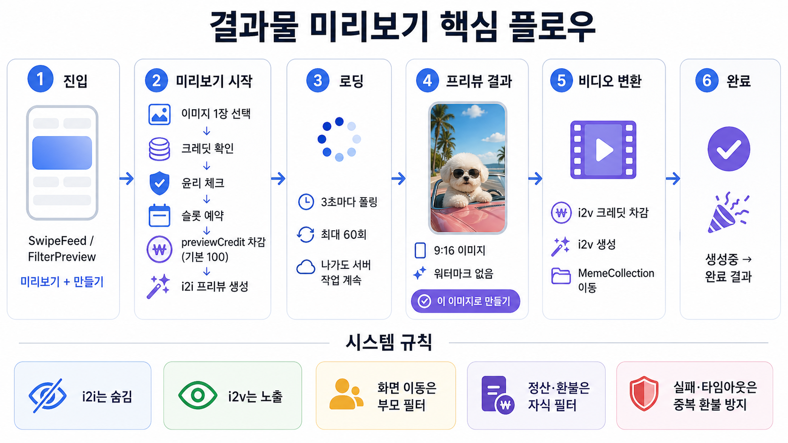
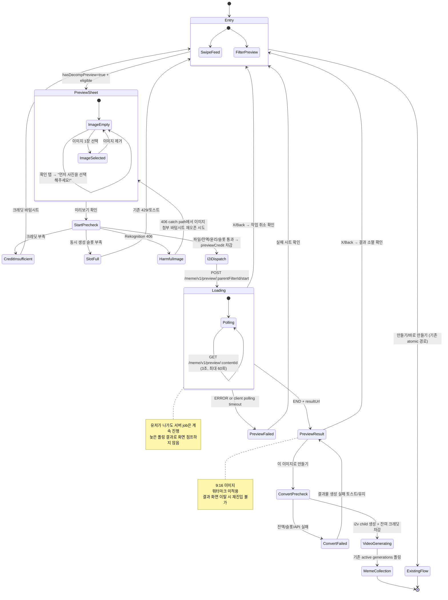

## 1. Overview

결과물 미리보기 서비스는 decomp workflow 필터(i2i + i2v)의 **i2i 결과 이미지를 먼저 보여주고**, 유저가 결과물을 확인한 뒤 **해당 이미지로 i2v 비디오 생성을 이어갈지** 결정하게 하는 기능이다.

- 진입면: `SwipeFeed`와 `FilterPreview` 모두에서 `hasDecompPreview: true`이고 1장 입력 대상인 필터에 미리보기 CTA를 노출한다.
- 실행 단위: 유저에게는 parent filter를 보여주되, 실제 생성·정산·환불은 `decompRole`이 지정된 i2i/i2v child filter로 수행한다.
- 전환 목표: 프리뷰 진입 대비 비디오 생성 전환율 2배 향상 목표 (~10% → ~20%).
- 기존 경로: [만들기]/[바로 만들기]는 기존 atomic workflow(i2i+i2v 일괄) 경로를 유지한다.

### 1.1 핵심 플로우 시각화

---

## 2. User Stories & Acceptance Criteria

### US-1: 유저는 workflow 필터의 결과물을 미리 확인하여 비디오 생성 여부를 결정한다

- **AC 2.1.1: 미리보기 CTA 노출**
  - Given: `SwipeFeed` 또는 `FilterPreview`에서 `hasDecompPreview: true`인 parent filter를 보고 있는 상태
  - When: 하단 CTA 영역이 렌더링될 때
  - Then: 미리보기와 기존 생성 CTA가 수평 배치된다
    - `SwipeFeed`: [미리보기] + [바로 만들기 🪙{총액}]
    - `FilterPreview`: [미리보기] + [{이미지|비디오} 밈 만들기 🪙{총액}]
  - And: `hasDecompPreview: false`이면 기존 단일 생성 CTA를 유지한다
  - And: `SwipeFeed`의 mixed-image-to-image / mixed-image-to-video 조합 필터는 기존처럼 `FilterPreview`로 이동하며 미리보기 듀얼 CTA를 노출하지 않는다

- **AC 2.1.2: 바텀시트 진입**
  - Given: 미리보기 CTA가 노출된 상태
  - When: [미리보기]를 탭하면
  - Then: "결과물 미리보기" 바텀시트가 열리고, 소구 텍스트 + [+] 이미지 첨부 UI + [미리보기 coin.png 100] 확인 액션이 표시된다
  - Note: `SwipeFeed` 진입은 기존 약관 확인, 크레딧/동시 생성 슬롯 사전 가드를 통과한 뒤 바텀시트를 연다

- **AC 2.1.3: 이미지 선택**
  - Given: 바텀시트가 열린 상태
  - When: [+] 버튼을 탭하면
  - Then: 기존 사진 앨범 선택 화면이 열리고 1장만 선택할 수 있다
  - And: 선택 후 바텀시트에 120x120 썸네일이 표시되며 X로 제거할 수 있다
  - And: ImageGuidance 시트는 표시하지 않는다
  - And: API 요청은 `jpeg`, `jpg`, `png`, `webp` 확장자만 허용한다

- **AC 2.1.4: 미리보기 확인 액션**
  - Given: 바텀시트가 열린 상태
  - When: 이미지가 선택되지 않은 상태에서 확인 액션을 탭하면
  - Then: "먼저 사진을 선택해주세요!" 토스트를 표시하고 요청을 보내지 않는다
  - When: 이미지가 선택된 상태에서 확인 액션을 탭하면
  - Then: 클라이언트는 빠른 연속 탭을 차단하고 preview start 요청을 1회만 보낸다
  - And: 성공 또는 일반 실패 시 바텀시트는 닫힌다
  - And: Rekognition 406 실패 시 앱은 406 에러 처리 후 이미지 첨부 바텀시트를 다시 열도록 시도한다

- **AC 2.1.5: 미리보기 실행 — 서버 검증/실행 순서**
  - Given: 이미지가 선택된 상태에서
  - When: preview start API가 호출되면
  - Then: 서버는 parent filter 조회 및 `hasDecompPreview` 검증 → i2i child filter 조회 → 파일 존재 검증 → previewCredit 산정(최소 0) → 크레딧 잔액 확인 → Rekognition 윤리 체크 → 동시 생성 슬롯 예약 → i2i Content 생성 + previewCredit 차감 → fal.ai i2i 호출 순서로 처리한다
  - And: 크레딧 차감 전에 파일/잔액/윤리 검증이 완료되므로 검증 실패로 인한 크레딧 손실이 없다
  - And: fal.ai dispatch는 DB 트랜잭션 커밋 이후에만 수행한다

- **AC 2.1.6: 크레딧 부족**
  - Given: 크레딧 잔액이 previewCredit(기본 100) 미만인 상태에서
  - When: 미리보기를 시작하려 하면
  - Then: 기존 크레딧 부족 바텀시트가 표시된다 ("크레딧이 다 떨어졌어요")
  - And: 서버에서는 Rekognition 호출, 슬롯 예약, 크레딧 차감을 수행하지 않는다

- **AC 2.1.7: 유해 이미지 감지**
  - Given: 크레딧 잔액이 충분한 상태에서
  - When: Rekognition이 유해 이미지로 판정하면
  - Then: 유해 이미지 바텀시트가 표시된다 ("적절하지 않은 이미지를 감지했어요")
  - And: 현재 frontend v1은 "다른 사진 선택하기" confirm handler에 406 전용 동작을 두지 않고, startPreview 406 catch path에서 이미지 첨부 바텀시트 재오픈을 시도한다

- **AC 2.1.8: 로딩 화면**
  - Given: i2i API 호출이 시작된 상태
  - When: 바텀시트가 닫히면
  - Then: 전체 화면 로딩 뷰로 전환된다 (좌상단 floating X + 스피너 + "미리보기 만드는중...")
  - And: 클라이언트는 `GET /meme/v1/preview/:contentId`를 3초 간격으로 최대 60회 폴링한다
  - And: iOS 스와이프 백 및 Android 하드웨어 백은 확인 시트를 거치도록 차단한다

- **AC 2.1.9: 로딩 중 이탈**
  - Given: 로딩 화면이 표시된 상태에서
  - When: X 버튼 또는 시스템 백을 탭하면
  - Then: 표준 BottomConfirmSheet가 표시된다 (title: "작업 취소", description: "지금 나가면 작업이 취소되고, 사용한 크레딧은 환불되지 않아요.", [취소] [나가기])
  - And: 나가기를 확정한 뒤 늦게 폴링 결과가 도착해도 `PreviewResult`로 화면 점프하지 않는다
  - And: 서버의 fal.ai job은 계속 진행되며, 유저 이탈 자체는 취소/환불 사유가 아니다
  - And: 이후 콜백/서버 타임아웃 도착 시 슬롯/상태를 정리하고, ERROR/서버 타임아웃이면 AC 2.3.4 환불 정책을 따른다

- **AC 2.1.10: 프리뷰 결과 표시**
  - Given: i2i 생성이 완료된 상태
  - When: status API가 `END`와 `resultUrl`을 반환하면
  - Then: 전체 화면에 프리뷰 이미지가 9:16 비율로 표시되고, 하단에 [이 이미지로 만들기 🪙{max(총액 - previewCredit, 0)}] 버튼이 표시된다
  - And: 프리뷰 이미지에는 워터마크를 적용하지 않는다
  - And: 결과 화면은 좌상단 floating X를 사용하고, 헤더/시스템 gesture back은 사용하지 않는다
  - And: 앱 route param 계약은 `PreviewLoading: { contentId, parentFilterId }`, `PreviewResult: { contentId, resultUrl, filterRequiredCredit }`를 사용한다

- **AC 2.1.11: 결과 화면 이탈**
  - Given: 프리뷰 결과 화면이 표시된 상태에서
  - When: X 버튼 또는 시스템 백을 탭하면
  - Then: 표준 BottomConfirmSheet가 표시된다 ("나가면 이 결과물을 다시 볼 수 없어요" [취소] [나가기])
  - And: Figma 시안에 없는 추가 안내문은 표시하지 않는다

- **AC 2.1.12: 프리뷰 실패/클라이언트 폴링 타임아웃**
  - Given: 로딩 화면에서 폴링 중인 상태
  - When: 서버 status가 `ERROR`가 되거나 클라이언트 폴링 60회가 초과되면
  - Then: "미리보기 생성 실패" 시트를 표시하고 "확인" 시 이전 화면으로 복귀한다
  - And: 서버에서 i2i 실패/타임아웃이 확정되면 previewCredit 환불 경로가 실행된다

---

### US-2: 유저는 프리뷰 결과가 마음에 들면 해당 이미지로 비디오를 생성한다

- **AC 2.2.1: 비디오 생성 전환**
  - Given: 프리뷰 결과 화면에서 이미지를 확인한 상태
  - When: [이 이미지로 만들기 🪙{잔액}] 버튼을 탭하면
  - Then: 서버는 preview Content가 `decompRole=i2i`, `isHidden=true`, `END`, `resultUrl` 보유 상태인지 검증한다
  - And: parent filter와 i2v child filter를 조회한다
  - And: i2v 크레딧(`max(총액 - previewCredit, 0)`) 잔액을 슬롯 예약 전에 확인한다
  - And: i2v Content를 `isHidden=false`, `decompRole=i2v`, `parentFilterId=parent.id`로 생성하고 i2v 크레딧을 차감한 뒤 fal.ai i2v를 호출한다
  - And: 앱은 convert 성공 후 `MemeCollection`으로 이동한다

- **AC 2.2.2: i2v 생성 진행 표시**
  - Given: i2v API 호출 후 `MemeCollection`으로 이동한 상태
  - When: 기존 active generations 폴링이 동작하면
  - Then: i2v Content가 "생성중..." 상태로 표시되고, 완료 시 결과 썸네일로 전환된다
  - And: hidden i2i preview Content는 active generations에 노출되지 않는다

- **AC 2.2.3: 기존 만들기 경로 유지**
  - Given: `hasDecompPreview: true`인 필터의 `SwipeFeed` 또는 `FilterPreview` 화면에서
  - When: [바로 만들기]/[만들기 🪙{총액}] 버튼을 탭하면
  - Then: 기존 atomic workflow(i2i+i2v 일괄) 경로가 그대로 실행된다

- **AC 2.2.4: 변환 실패 문구**
  - Given: convert API 또는 i2v 생성 시작이 실패한 상태
  - When: 앱이 에러를 표시하면
  - Then: i2i/i2v 양쪽에 모두 맞도록 "결과물 생성에 실패했어요" 문구를 사용한다

---

### US-3: 시스템은 프리뷰 콘텐츠를 기존 플로우와 격리한다

- **AC 2.3.1: 프리뷰 Content 비노출**
  - Given: i2i 프리뷰로 생성된 Content가 존재하는 상태
  - When: MemeCollection 목록, unread badge, status count, active generations API가 호출되면
  - Then: `isHidden: true`인 i2i Content는 유저-facing 목록/카운트/폴링 결과에서 제외된다

- **AC 2.3.2: parentFilterId 기반 네비게이션/공유**
  - Given: i2v로 생성된 decomp Content가 MemeCollection에 표시된 상태
  - When: 재생성, 필터 공유 링크 등 유저-facing 경로로 진입할 때
  - Then: 재생성 및 필터 공유 링크는 Content 응답의 `parentFilterId`를 우선 사용하고, 없을 때만 `filterId`를 fallback으로 사용한다
  - And: 이벤트 로깅, Content identity, 생성/정산/환불 attribution은 child `filterId`를 유지한다
  - And: 현재 앱 v1의 워터마크 제거 CreditPaywall 진입은 `filterId`를 사용한다. 이를 parent 기준으로 바꾸려면 별도 FE 수정이 필요하다

- **AC 2.3.3: 콜백 분기 처리**
  - Given: fal.ai에서 생성 완료 콜백이 도착한 상태
  - When: 해당 Content의 `decompRole`이 `i2i`이면
  - Then: S3 저장, 썸네일 생성, 워터마크 적용 후처리를 건너뛰고, fal.ai CDN URL을 `resultUrl`로 보존한다
  - When: `decompRole`이 `i2v` 또는 일반 Content이면
  - Then: 기존 후처리 로직을 실행한다
  - And: 콜백 DTO는 video `url`만 있는 payload, error detail 배열, `payload=null` + `payload_error`, 빈 image 배열 등 fal.ai 변형을 domain error handling까지 전달할 수 있어야 한다

- **AC 2.3.4: i2i 실패/타임아웃 시 전액 환불**
  - Given: i2i API 호출 후 생성이 실패하거나 서버 타임아웃으로 ERROR 처리된 상태
  - When: 에러 콜백 또는 타임아웃 정리 경로가 실행되면
  - Then: previewCredit이 전액 환불된다
  - And: contentId 매칭이 누락된 timeout 케이스는 생성에 사용된 child `filterId`와 `contentCreatedAt` 기준 ±1분 윈도우로 환불 후보를 찾는다
  - And: 최근 timeout ERROR Content sweep은 24시간 범위에서 최대 200건만 보정하며, `hasRefundByContentId`로 이미 환불된 건은 건너뛴다

- **AC 2.3.5: i2v 실패/타임아웃 시 부분 환불**
  - Given: i2v API 호출 후 생성이 실패하거나 서버 타임아웃으로 ERROR 처리된 상태
  - When: 에러 콜백 또는 타임아웃 정리 경로가 실행되면
  - Then: i2v 크레딧(`총액 - previewCredit`)만 환불된다
  - And: i2i 크레딧(previewCredit)은 유지된다 (프리뷰 서비스 이행됨)
  - And: 환불/정산 detail history는 실제 생성 child filterId 기준으로 기록된다

- **AC 2.3.6: 동시 생성 슬롯 관리**
  - Given: 기존 동시 생성 슬롯 풀(MAX_CONCURRENT_GENERATIONS)이 운영되는 상태
  - When: 프리뷰 i2i 또는 i2v가 실행되면
  - Then: 동일한 슬롯 풀에서 슬롯을 점유한다
  - And: 잔액 부족/검증 실패는 슬롯 예약 전에 fail-fast한다
  - And: i2i 완료 후 슬롯을 반환하고, i2v 시 다시 점유한다
  - And: 슬롯 부족 시 기존 429 에러 패턴을 재사용한다

- **AC 2.3.7: decomp 필터 데이터 무결성**
  - Given: Admin에서 decomp child filter를 생성/수정하는 상태
  - When: `decompRole` 또는 `parentFilterId`를 지정하면
  - Then: 두 필드는 함께 지정되어야 한다
  - And: `previewCredit`은 parent filter에만 설정 가능하며 0 이상이어야 한다
  - And: Admin에서 `decompRole=i2i` child filter를 생성하면 backend가 parent filter의 `hasDecompPreview`를 자동으로 true로 켠다
  - And: child 생성/수정 시 parent filter 존재를 검증한다
  - And: `(parentFilterId, decompRole)` 복합 유니크 제약은 soft-delete(`deletedAt:null`) 조건에서만 적용된다

- **AC 2.3.8: 모델 계약**
  - Given: preview i2i/i2v child filter가 실행되는 상태
  - When: fal.ai input을 만들면
  - Then: i2i는 `fal-ai/nano-banana-2/edit`, i2v는 `bytedance/seedance-2.0/fast/image-to-video` 모델 계약을 지원한다
  - And: Seedance Fast I2V는 `prompt` + `image_url` 중심 계약을 사용하고, 지원하지 않는 shared factory 필드는 fal.ai 요청에서 제거한다
  - And: `generateAudio=false`, `cameraFixed=false` 같은 boolean false 값은 모델 default로 덮이지 않아야 한다

---

## 3. State Machine

---

## 4. Business Rules

- **BR-1: 과금 구조**
  - Identity boundary: 유저-facing 표시/이동은 parent filter, 실행/정산/환불은 child filter를 원칙으로 한다
  - 총액 = parent filter의 credit plan price / requiredCredit (예: 3960)
  - i2i 프리뷰 차감: 서버 기준 `previewCredit` (기본 `DEFAULT_PREVIEW_CREDIT = 100`, parent option으로 override 가능, 최소 0)
  - i2v 비디오 차감: 서버 기준 `max(총액 - previewCredit, 0)` (예: 3860)
  - 총액은 항상 parent 기준으로 유저에게 표시한다
  - child filter의 requiredCredit은 유저 표시 금액으로 사용하지 않는다
  - credit history의 title/thumbnail/display metadata는 parent filter 기준으로 표시한다
  - credit detail/refund/accounting의 `filterId`는 실제 생성 child filter 기준으로 기록한다
  - 현재 frontend v1은 `PREVIEW_CREDIT = 100` 고정값으로 사전 잔액 확인/버튼 표시/결과 화면 잔여 크레딧 계산(`max(filterRequiredCredit - PREVIEW_CREDIT, 0)`)을 수행한다
  - parent `previewCredit` override를 앱에 반영하려면 filter/status/route param 계약에 `previewCredit`을 추가해야 한다
  - 앱 크레딧 내역 description은 `preview:*` → "미리보기(이미지)", `preview_convert:*` → "미리보기(결과물)"로 변환한다
  - → AC 2.1.5, AC 2.2.1, AC 2.3.5 참조

- **BR-2: 검증 순서**
  - 파일 존재 검증 → 크레딧 잔액 확인 → Rekognition 윤리 체크 → 슬롯 예약 → DB 트랜잭션(Content 생성 + 크레딧 차감) → fal.ai dispatch
  - 크레딧 차감은 모든 유저 입력/잔액/윤리 검증 통과 후에만 실행한다
  - fal.ai dispatch 및 filter count increment는 DB 트랜잭션 커밋 이후에만 실행한다
  - → AC 2.1.5 참조

- **BR-3: 환불 정책**
  - i2i 실패/서버 타임아웃 → previewCredit 전액 환불
  - i2v 실패/서버 타임아웃 → i2v 크레딧(`총액 - previewCredit`)만 환불, previewCredit은 유지
  - timeout 환불은 idempotent해야 하며, child filterId + contentCreatedAt fallback 및 24시간 bounded sweep으로 최근 미환불 건을 보정한다
  - 무료 필터/무료 쿼터가 함께 적용된 경우 timeout sweep에서 무료 쿼터 rollback도 수행한다
  - → AC 2.3.4, AC 2.3.5 참조

- **BR-4: 동시 생성 슬롯**
  - 프리뷰 i2i, 프리뷰 i2v, 기존 생성은 동일 슬롯 풀(MAX_CONCURRENT_GENERATIONS)을 공유한다
  - startPreview/convertToVideo는 잔액 부족을 슬롯 예약 전에 확인한다
  - i2i 완료 후 슬롯 반환 → 유저 결정 → i2v 시 슬롯 재점유
  - 슬롯 부족 시 기존 429 에러 패턴 재사용
  - → AC 2.3.6 참조

- **BR-5: 타임아웃/폴링**
  - 클라이언트 preview status polling: 3초 간격, 최대 60회(약 3분) 후 실패 시트 표시
  - 서버 기본 모델 timeout: `DEFAULT_TIMEOUT_MINUTES = 20`
  - preview i2i 모델 `fal-ai/nano-banana-2/edit`: 10분
  - preview i2v 모델 `bytedance/seedance-2.0/fast/image-to-video`: 5분(임시 축소 값)
  - workflow 모델 timeout: 20분
  - 클라이언트 polling timeout은 UX 종료이며, 서버 환불은 서버 error/timeout 확정 경로에서 처리한다
  - 현재 v1에서 클라이언트 polling timeout 이후 서버가 성공하면 앱 재진입 경로를 제공하지 않는다. 이 경우 previewCredit은 클라이언트 timeout만으로 환불되지 않는 known risk이며, 정책 변경은 PM 확인이 필요하다
  - 클라이언트 preview polling은 `contentId`가 변경될 때 polling count를 0으로 reset해 이전 preview의 poll count가 새 preview를 조기 timeout 처리하지 않게 한다
  - → AC 2.1.8, AC 2.1.12 참조

- **BR-6: 워터마크 정책**
  - i2i 프리뷰 이미지에 워터마크를 적용하지 않는다
  - 프리뷰 목적(결과물 품질 확인)에 충실하기 위한 결정
  - → AC 2.1.10 참조

- **BR-7: 프리뷰 이미지 수명**
  - i2i 완료 시 fal.ai CDN URL을 직접 사용한다 (S3 복사 없음)
  - 결과 화면이 열려있는 동안만 유저가 볼 수 있다
  - 결과 화면 이탈 시 앱에서 재진입 경로를 제공하지 않는다
  - CDN URL 만료/접근 실패 시 i2v 실패 가능 → 기존 에러/환불 핸들링으로 처리
  - → AC 2.1.10, AC 2.1.11 참조

- **BR-8: hasDecompPreview 자동 세팅**
  - agent/admin endpoint에서 `decompRole: 'i2i'` child filter 등록 시 parent filter에 `hasDecompPreview: true`를 자동 세팅한다
  - Admin filter update는 `decompRole`, `previewCredit`, `parentFilterId`, `hasDecompPreview` 응답 필드를 보존/노출해야 한다
  - Content Factory 생성 파이프라인 변경 없음 — 기존 child filter 등록 구조를 유지한다. 단, Admin/API의 decomp 필드 보존·검증 및 `hasDecompPreview` 자동 세팅은 범위에 포함한다
  - → AC 2.1.1, AC 2.3.7 참조

- **BR-9: 콘텐츠 노출 규칙**
  - i2i Content: `isHidden: true`, MemeCollection/unread/count/active generations 비노출
  - i2v Content: `isHidden: false`, MemeCollection/active generations 정상 노출
  - 서버 콘텐츠 목록 API에서 hidden Content를 필터링한다
  - → AC 2.3.1 참조

- **BR-10: parentFilterId 사용 규칙**
  - 재생성 및 필터 공유 링크 → `parentFilterId` 우선
  - 일반 Content 또는 parent가 없는 경우 → `filterId` fallback
  - 이벤트 로깅, Content identity, BQ/비용/정산/환불 추적 → 실제 child `filterId`
  - 현재 워터마크 제거 CreditPaywall 진입은 앱 v1 코드상 `filterId`를 사용한다
  - → AC 2.3.2 참조

- **BR-11: 콜백 분기**
  - 기존 fal.ai 콜백 경로 재사용
  - Content의 `decompRole === 'i2i'` → S3 저장, 썸네일 생성, 워터마크 적용 후처리 스킵
  - `decompRole !== 'i2i'` → 기존 후처리 로직 그대로 실행
  - fal.ai callback DTO는 success, validation error, payload null, payload_error, video-only-url payload, empty images 등 실제 payload 변형을 수용한다
  - → AC 2.3.3 참조

- **BR-12: 적용 대상 제한**
  - decomp workflow 필터(i2i+i2v 조합)에만 적용한다
  - 1장 입력 필터 전용이다
  - `SwipeFeed`에서는 mixed-image-to-image / mixed-image-to-video 조합 필터에 미리보기 듀얼 CTA를 노출하지 않는다
  - 2장 입력 필터에는 미적용한다 (운영으로 배제)
  - → AC 2.1.1 참조

- **BR-13: API 계약**
  - `POST /meme/v1/preview/:parentFilterId/start`
    - request: `{ files: [{ fileUuid: UUID, fileExtension: jpeg|jpg|png|webp }] }` (1장 고정)
    - response: `{ contentId }` (i2i preview Content ID)
  - `GET /meme/v1/preview/:contentId`
    - response: `{ contentId, status, resultUrl }`
    - 완료 전 `resultUrl`은 null
  - `POST /meme/v1/preview/:contentId/convert`
    - response: `{ contentId }` (i2v Content ID)
  - 더 이상 `GET /preview/:contentId/status` 경로를 사용하지 않는다
  - → AC 2.1.8, AC 2.2.1 참조

---

## 5. 3-Tier Boundary

### ALWAYS (자동 실행)
- `SwipeFeed`와 `FilterPreview`에서 eligible parent filter에 미리보기 듀얼 CTA를 노출한다
- preview 전용 엔드포인트 3개를 사용한다: start/status/convert
- preview start는 parent filter ID를 받고, 서버에서 i2i child filter를 찾아 실행한다
- decomp child filter는 user-facing active filter 목록에 노출하지 않으며, preview start/convert 전용 lookup으로만 조회한다
- preview convert는 preview content ID를 받고, 서버에서 parent 및 i2v child filter를 찾아 실행한다
- 기존 fal.ai 콜백 경로를 재사용하고, `decompRole`로 i2i 프리뷰 콘텐츠를 분기한다
- i2i Content 생성 시 `isHidden: true`, `parentFilterId`, `decompRole: 'i2i'`, `resultUrl` 보존 규칙을 적용한다
- i2v Content 생성 시 `isHidden: false`, `parentFilterId`, `decompRole: 'i2v'`를 세팅한다
- 검증 순서(파일 → 크레딧 → Rekognition → 슬롯 → 차감 → API)를 반드시 유지한다
- 기존 서비스를 재사용한다 (크레딧, fal.ai, Rekognition, 환불, active generations 등)
- i2v는 기존 active generations 폴링 경로를 그대로 사용한다
- i2i 프리뷰 콜백에서 S3 저장, 썸네일 생성, 워터마크 적용 후처리를 스킵한다
- Content 응답에 `parentFilterId`와 `decompRole`을 포함하고, 앱 재생성/공유는 parent filter를 우선 사용한다
- credit detail/refund/accounting은 child filterId 기준으로 유지한다
- timeout 환불 sweep은 bounded/idempotent하게 유지한다

### ASK (PM 확인 필요)
- previewCredit 기본값(100) 변경 또는 parent option override를 frontend 표시/사전 잔액 확인에 반영할 때
- previewCredit 값을 Unleash/remote config로 승격하는 시점
- Seedance Fast I2V timeout 5분 임시 축소 값을 정식 운영값으로 확정할 때
- i2i 프리뷰 polling 3분 UX timeout을 늘리거나 줄일 때
- Re-roll(다시 생성), multi-candidate, 프리뷰 저장소 보관 등 비용 구조가 바뀌는 기능을 추가할 때

### NEVER DO (금지)
- 기존 gen 엔드포인트를 preview 용도로 수정하지 않는다 — preview 전용 엔드포인트를 사용한다
- `GET /preview/:contentId/status` 과거 경로를 다시 사용하지 않는다
- child filter의 `isActive`를 true로 변경하지 않는다 — 기존 active filter 조회 로직에 영향을 준다
- 기존 `findOneActive()` 등 활성 필터 조회 로직을 preview 지원 목적으로 변경하지 않는다
- 유저-facing 재생성/공유에 decomp child filterId를 우선 사용하지 않는다
- i2i 프리뷰 이미지에 워터마크를 적용하지 않는다
- i2i 프리뷰 결과를 S3에 복사하지 않는다 — fal.ai CDN URL을 직접 사용한다
- Content Factory 코드를 preview 전용으로 분기해 기존 atomic workflow를 깨지 않는다
- 기존 atomic workflow("만들기" 경로)를 제거하거나 변경하지 않는다
- timeout 환불 sweep을 idempotency 보장 없이 넓은 historical scan으로 확장하지 않는다

---

## 6. Out of Scope

- Re-roll (다시 생성): 프리뷰 결과가 마음에 안 들 때 다시 생성하는 기능. 향후 전환율 데이터를 보고 결정
- Multi-candidate (후보 선택): 여러 프리뷰 결과 중 선택하는 기능. 비용 구조가 달라져 별도 기획 필요
- 프리뷰 이미지 영구 저장: 갤러리에 프리뷰 이미지를 보관하는 기능. 현재는 세션 내 유지, 이탈 시 소멸
- 단독 i2v 필터 적용: i2i+i2v 조합이 아닌 단독 i2v 필터에는 프리뷰 개념이 성립하지 않음
- 2장 입력 필터 지원: 현재 1장 입력 필터만 대상. 2장 입력 필터는 운영으로 배제
- 재시도 로직: 생성 실패 시 자동 재시도 없음. 기존 시스템과 동일하게 유저가 직접 재시도
- Content Factory 생성 파이프라인 재설계: child filter 등록 구조 변경이나 신규 어드민 UI/운영 도구 추가는 제외한다. 단, 기존 Admin/API의 decomp 필드 보존·검증 및 `hasDecompPreview` 자동 세팅은 범위에 포함한다.
- 프리뷰 결과 공유/저장: i2i preview 결과 자체를 공유하거나 영구 저장하는 기능은 제공하지 않음
